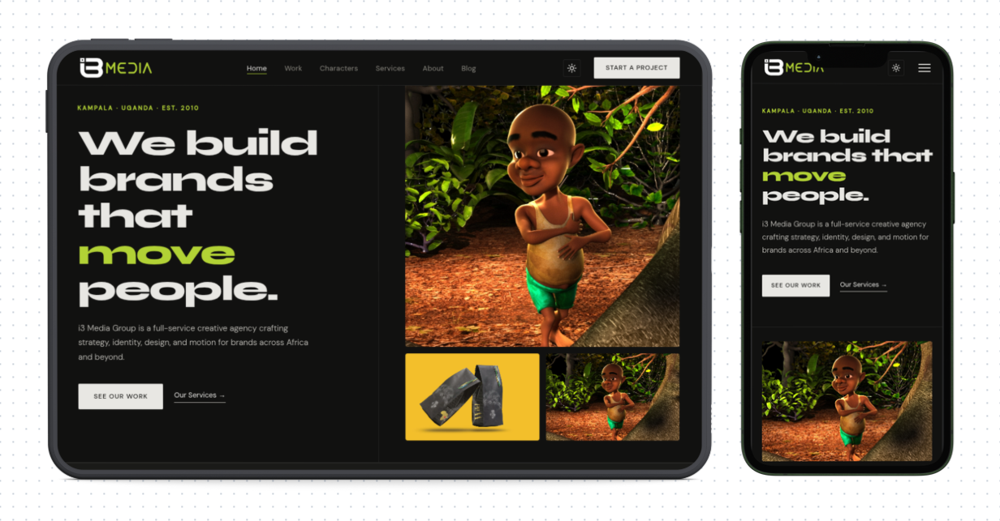

<CaseStudyLayout>

## Where they were

The client had a website, but it no longer represented who they were or the quality of work they were producing. For a brand in the animation space, your website is essentially your first impression and their old one was not making the right one. They came to us wanting something that felt as creative and considered as the work they put out.

## The challenge

An animation brand is a particular kind of client to design for. The website cannot just look clean. It has to feel alive in some way, like it belongs to people who think visually for a living. Getting that balance right without overdesigning it took a few rounds of exploration before we landed on a direction that felt true to who they are.

## How we worked together

The client was deeply involved throughout the project, which made all the difference. They had a strong sense of their brand and were not shy about saying when something was not right. Rather than slow things down, that clarity helped us move faster in the right direction. We shared work in progress regularly, took feedback seriously, and refined until it felt right.

The whole project came together over about a month from the first conversation to the final handover.

## How it looks

## The result

The new website gives the brand a home that matches the standard of their work. It is clean, modern, and built to grow with them as they take on more clients and expand their portfolio.

</CaseStudyLayout>
