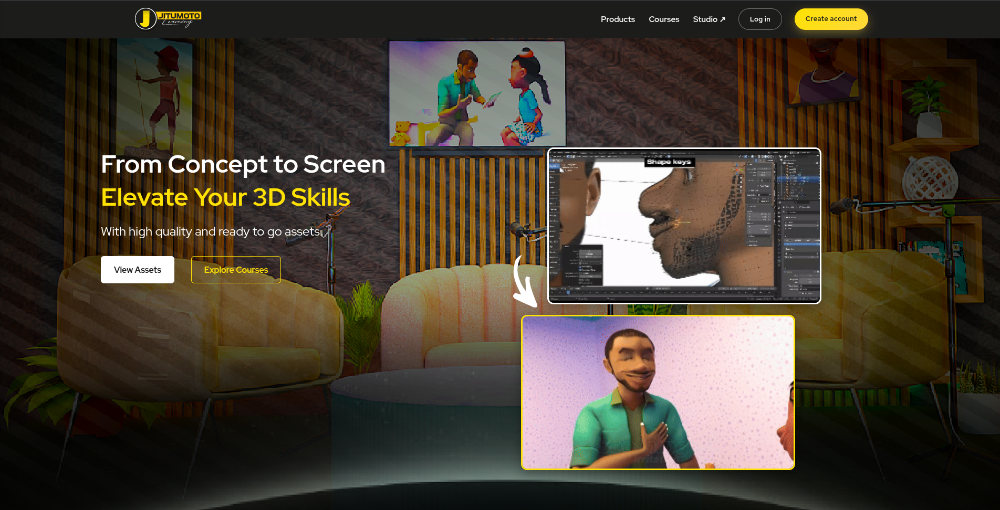

<CaseStudyLayout>

## Where they were

Jitumoto Animations had built a reputation for quality animation content and wanted to share that knowledge with students across the region. The problem was they had no platform to do it on. Everything was being done manually or through third party tools that were not built for what they needed.

They came to us with a vision and we built it from the ground up.

## What we built

The platform gives students access to animation courses and digital assets in one place. They can browse what is available, purchase what they need, and get access immediately after payment. For the Jitumoto team, there is a backend where they manage courses, upload assets, and keep track of what is selling.

## The payments challenge

Serving students across East Africa meant that card payments alone were not going to cut it. A student in Nairobi pays differently from one in Dar, and the platform needed to reflect that without making the experience complicated for either of them.

We integrated M-Pesa for Kenyan users, Airtel Money to cover a wider regional reach, and card payments for anyone outside that. Whichever method a student uses, the platform confirms the payment and unlocks access without any manual work on the studio's end.

## How it went

Starting from scratch on a project this size meant there were a lot of moving parts to coordinate. The payments side in particular required careful testing across each method before we were comfortable going live. We took the time to get it right rather than rushing to a launch date.

## How it looks

## The result

Jitumoto Animations now has a platform that is entirely their own. Students across the region can access their content using a payment method that works for them, and the studio has full control over what they offer and how they grow it.

</CaseStudyLayout>
