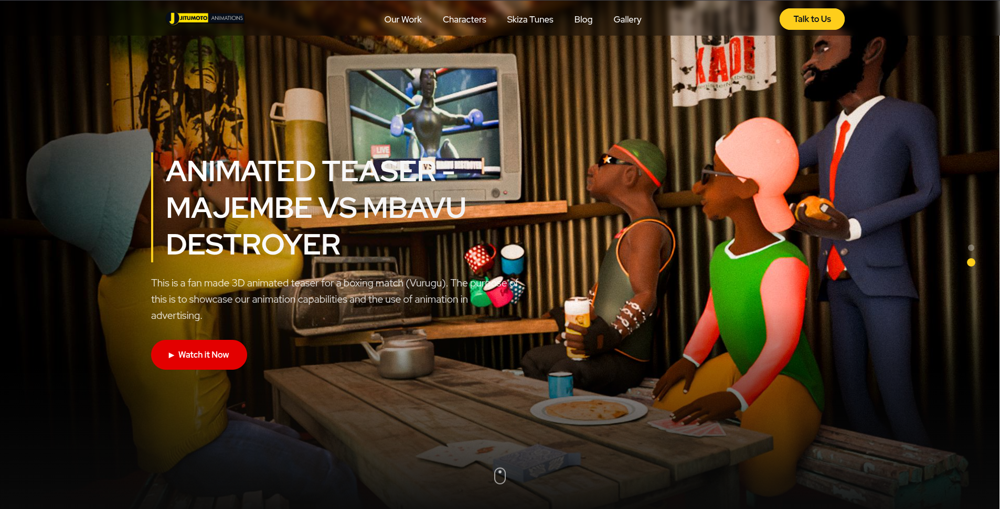
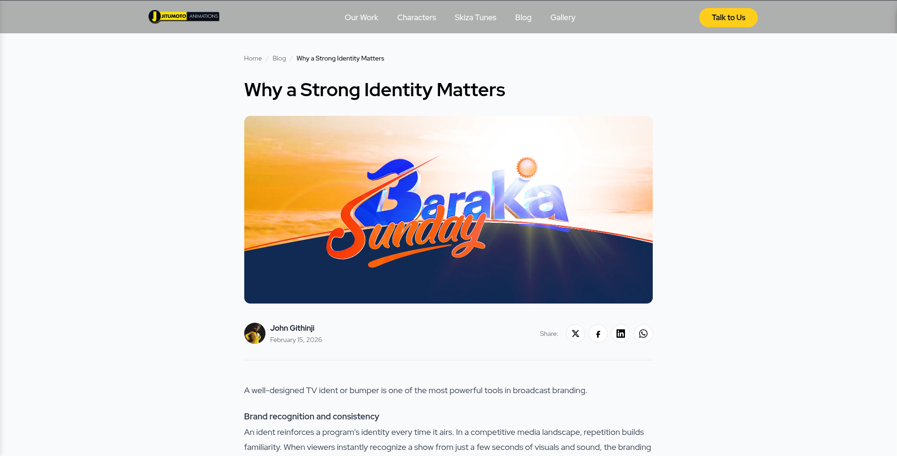
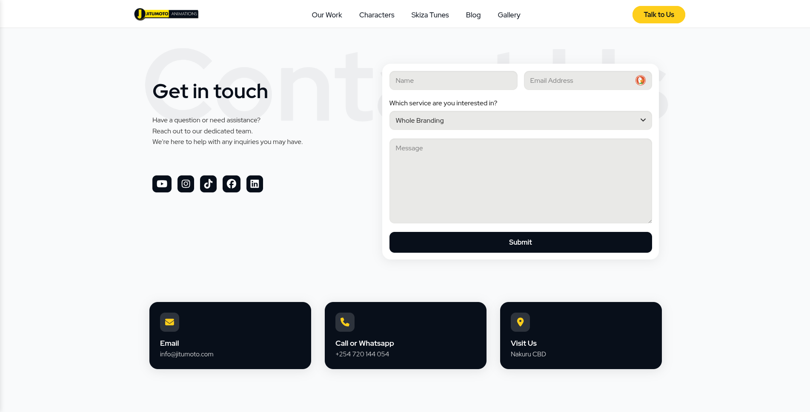

<CaseStudyLayout>

## Where they were

Jitumoto Animations had a website, but it had outgrown it. The studio had expanded what they were doing and the old site could not keep up. There was no space to properly showcase their characters, and no way to present their products in a way that did them justice.

They came to us wanting a redesign that could hold everything the studio had become.

## What we built

We redesigned the website from the ground up with a look that felt worthy of a creative studio. The new site gives their characters a proper home, a blog for sharing updates and behind the scenes content, and a products section that presents what they offer cleanly and clearly.

A content management system sits behind all of it so the team can keep things fresh without touching any code.

## How it went

This was one of the smoother projects we have worked on. The client came in with a clear picture of what they needed and trusted us to bring it to life. We moved from the first conversation to a finished website without any major detours.

## How it looks

## The result

Jitumoto Animations now has a website that grows with them. New characters and products can go live whenever they are ready without waiting on anyone.

> "They [Wajuaji Digital] are highly skilled and well informed in matters Software and web development. They are great to work with." — John, Founder via LinkedIn

</CaseStudyLayout>
