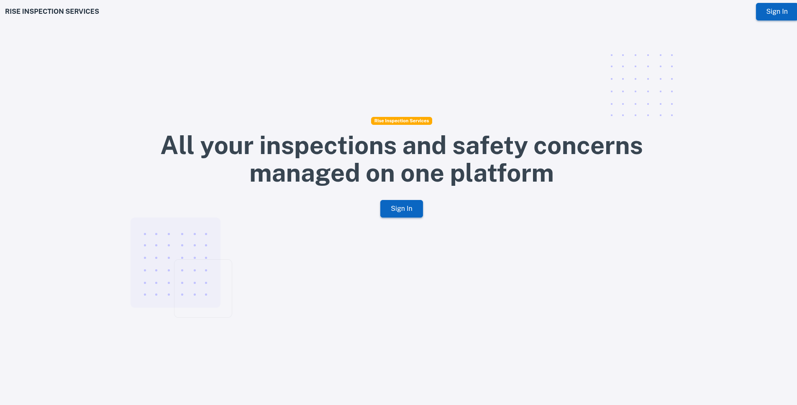

<CaseStudyLayout>

## Where they were

Rise Inspection Services was running their operations the hard way. Inspection assignments were being handled manually, invoices were being tracked on spreadsheets, and keeping records in order took more effort than it should have. For a company managing multiple inspectors and clients at the same time, that approach had a ceiling and they were hitting it.

They needed a system that could handle the operational side of the business without someone having to manage it by hand.

## What we built

We built an internal management dashboard that serves both the Rise team and their clients. Staff can log in and see what needs to be done, and clients have their own view where they can track inspections and access their invoices.

The centrepiece of the system is the inspection assignment engine. Rather than someone manually figuring out which inspector goes where, the system handles that on its own based on the relevant criteria. It was the part of the project that made the biggest difference to how the team operates day to day.

Beyond that, the tool manages invoicing for both clients and contractors, and keeps records in a way that is easy to search and refer back to.

## How it went

Working with a US-based client remotely required clear communication and a well structured process. We scoped the project carefully upfront so there were no surprises along the way, and kept in close contact throughout the build to make sure what we were delivering matched what they actually needed on the ground.

## How it looks

Given that this is an internal tool built for a private business, there is only so much we can share publicly. Below is a screenshot of the landing page.

## The result

Rise Inspection Services now runs their operations through a single tool built around how their business works. Inspections are assigned automatically, invoices go out without manual effort, and records are kept in a way that is easy to manage and refer back to.

> "Wajuaji Digital delivered exactly what we needed. They understood our needs quickly and built a system that has completely eliminated the manual work our team was doing every day. We would work with them again." — Mike Maccarino, Rise Inspection Services

</CaseStudyLayout>
